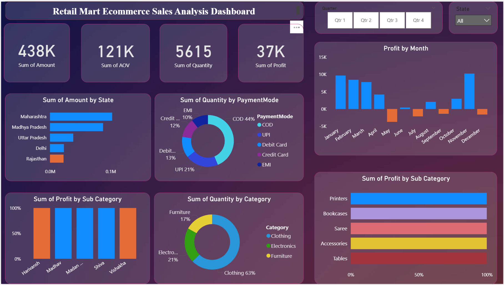

# RetailMart Ecommerce Sales Analysis Dashboard | Power BI

## Dashboard Preview

## Objective
The goal of this project is to analyze ecommerce sales data across India and create an interactive dashboard to track sales performance, profit trends, and customer purchasing behavior.

## Tools Used
- Power BI
- Data Visualization
- Data Analysis

## Dashboard Features
- Interactive filters and slicers
- Sales analysis by state
- Profit analysis by month
- Category and sub-category insights
- Payment mode analysis
